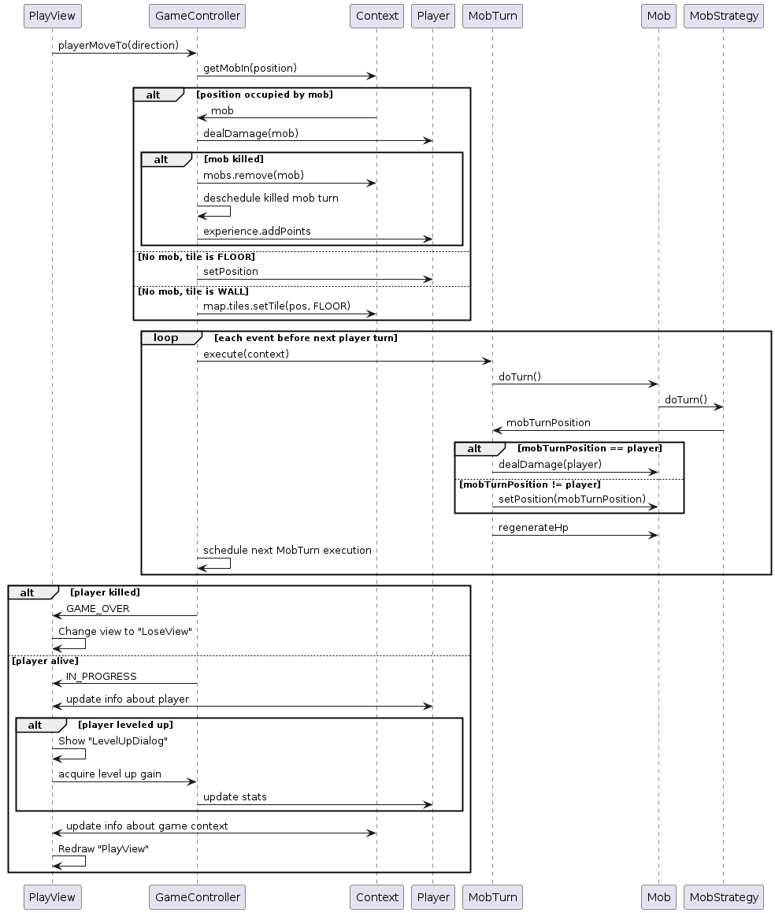

# krogue
krogue - это roguelike игра с тайловой [графикой](https://github.com/Hexworks/zircon), написанная на Kotlin.

Авторы: Кирилл Митькин, Андрей Хорохорин

### Диаграмма иерархии классов

### Диаграмма компонентов

Связь компонентов в системе укладывается в стандартный паттерн Model-View-Controller.
* Компонент модели состоит из 3 основных компонентов: карты, игрока и мобов.
* Контроллер включает в себя очередь событий, непосредственно изменяющие состояние модели, и общается через линии логов
с основным логирующим классом Logger.
* View состоит из 3 основых View - PlayView, StartView и LoseView, где PlayView изменяет состояние системы
  посредством паттерном команда в api Controller.

### Диаграмма состояний UI

### Диаграмма последовательности событий при ходе игрока
Ниже приведена диаграмма последовательность событий при запросе игрока движения в определённом направлении.
в ответ.

### Роли и случаи использования

Роль всего одна - игрок.

Основной успешный сценарий:
1. Игрок нажимает на кнопку `Play`.
2. Игрок перемещается по уровню, собирает оружие и экипировку, убивает мобов.
3. При накоплении достаточного количества опыта высвечивается диалог с выбором повышаемой характеристики, где игрок
   повышает атаку.
4. Игрок выходит из игры, закрывая окно.

Расширения:

2a.  Количество HP игрока падает до нуля.

.1: Высвечивается окно проигрыша.

.2: Игрок нажимает на кнопку перезапуска игры и возвращается ко второму пункту.

.2a: Игрок нажимает на кнопку выхода из игры.

## Поведение мобов

Поведение мобов реализуется с помощью двухуровневой иерархии классов, состоящей из поведений (`Behavior`)
и стратегий (`MobStrategy`). Поведения отличаются от стратегий тем, что они не привязаны к юниту и,
следовательно, не могут содержать состояния.
То есть поведение может быть создано и использовано в любое время для любого юнита,
в то время как стратегия содержит юнит и некоторое состояние, влияющее на его ходы.

### Behaviors

#### Roam
Юнит переходит в произвольную свободную соседнюю ячейку. Если такой ячейки не существует, остаётся на месте.

#### ChasePlayer

#### Flee

### Strategies
#### PeacefulInhabitant
Является адаптером поведения `Roam` для стратегии. Т.е. юнит под управлением данной стратегии будет
всегда случайно бродить по карте.

#### PlayerChaser
Является адаптером поведения `ChasePlayer` для стратегии. Т.е. юнит под управлением данной стратегии будет
всегда преследовать и атаковать игрока

#### StaticDamageDealer
Стратегия, моб под управлением которой никогда не двигается и бьёт игрока, если тот располагается на соседней
клетке.

#### Withdrawer
Стратегия, моб под управлением которой нападает на игрока при достаточном уровне здоровья у моба и начинает
убегать, когда здоровье моба опускается ниже определённого значения.

