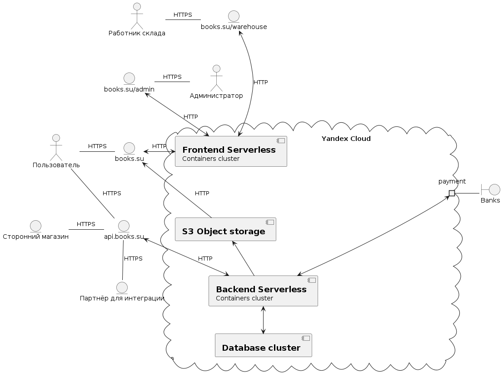
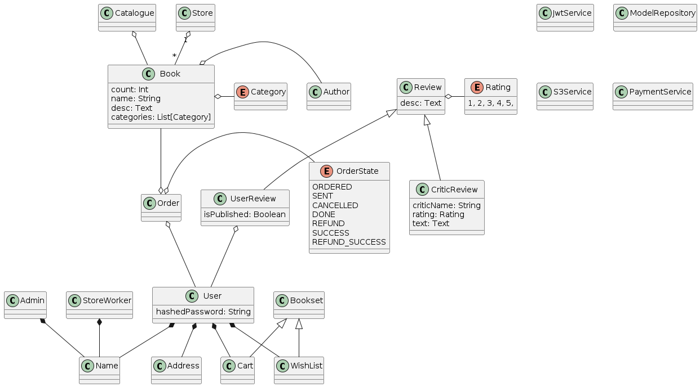
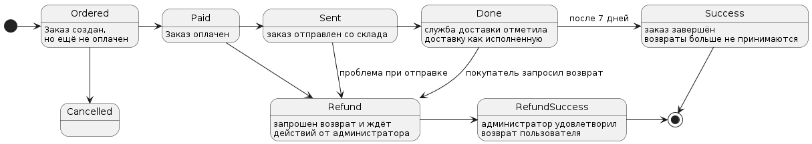
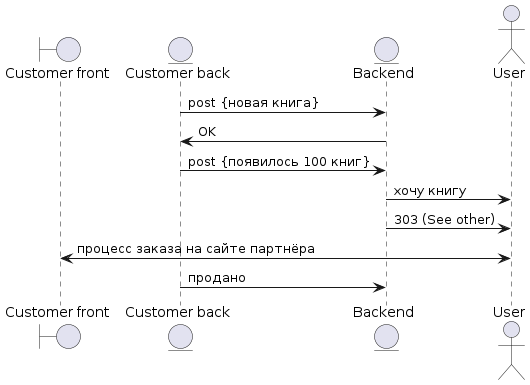

# Веб магазин книг
## Общие сведения о система
Система представляет собой интернет магазин бумажных книг, и характеризуется следующими сведениями:
1. Клиент-серверная монолитная архитектура
2. Фронтенд, бэкенд и база данных представлены кластерами с балансировщиками нагрузки уровня приложений для горизонтальной масштабируемости и достижения достаточного количества запросов в секунду.
## Architectural drivers
1. Минимизация уровня ответственности системы (отсутсвие банковских данных, сохранение хэшей паролей)
2. TODO
## Роли и случаи использования
Система характеризуется 6 ролями:
* Покупатель
* Администратор
* Сторонний магазин книг
* Партнер для интеграции
* Склад
* Банк (платежный сервис)

Основной сценарий использования:
1. Пользователь заходит на сайт, видит список всех книг.
2. Пользователь фильтрует книги по категории, открывает заинтересовавшую его книгу.
3. Пользователь просматривает отзывы к книге.
4. Пользователь добавляет книгу в корзину.
4а. Пользователь добавляет книгу в список желаемого.
5. Пользователь возвращается на страницу со всеми книгами.
6. Пользователь открывает корзину и хочет совершить покупку.
6а. Пользователь понимает, что не хочет покупать эту книгу и отменяет заказ (до оплаты это не требует подтверждения).
7. Система перенаправляет пользователя на платежный сервис, пользователь вводит платежные данные (вручную или автоматически) и совершает покупку.
8. После успешной оплаты склад получает информацию о смене статуса купленных книг на Ordered.
9. Люди со склада запаковывают книги и отправляют книги по почте, а также переводят их в статус отправленных.
10. Сервис доставки подтверждает получение книги пользователем, книга переводится в статус доставленной.
11. Пользователь оставляет отзыв о книге на странице сайта.
11а. Пользователь недоволен книгой, пользователь запрашивает возврат средств, администратор получает запрос на отмену.
11аа. Администратор принимает запрос, совершет транзакцию по возврату средств и перевод заказ в статус Cancelled.
11ab. Администратор отклоняет запрос на возврат средств.

Сценарий использования для покупки книги со стороннего магазина:
3а. При покупке пользователя перенаправляет на сайт стороннего магазина.
4. Пользователь совершает покупку на сайте стороннего магазина.
5. Пользователь возвращается на наш интернет-магазин и оставляет отзыв.

## Композиция

### Диаграмма компонентов

## Логическая структура

### Диаграмма классов

### Диаграмма состояний заказа

### Диаграмма интеграции партнёра

